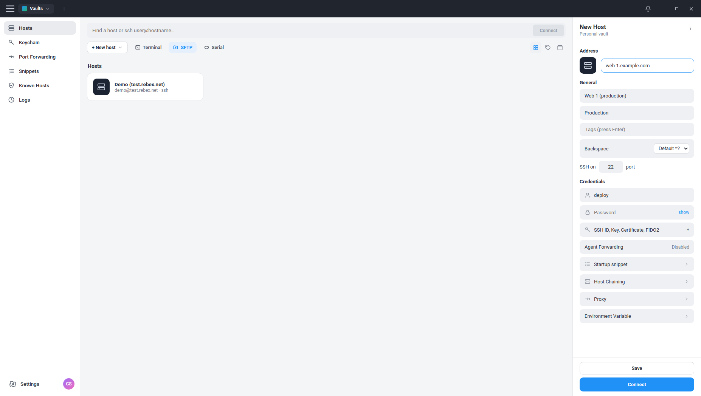
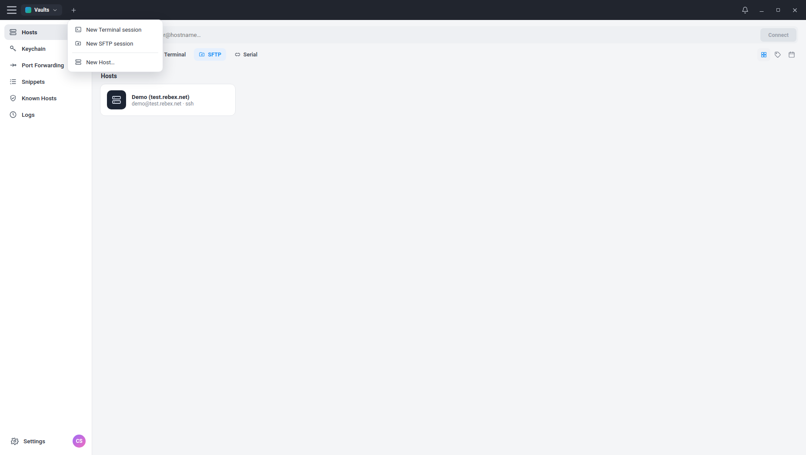
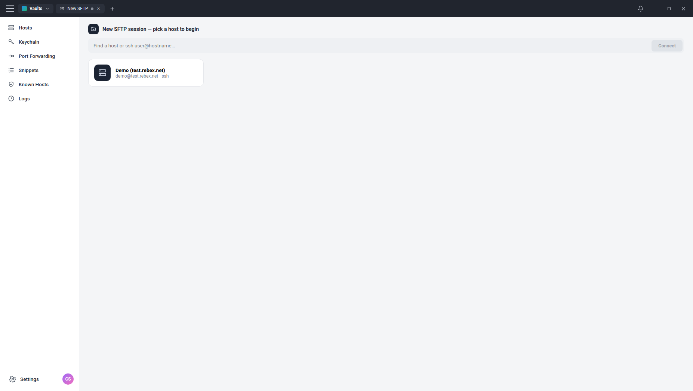

<div align="center">


# Termio

**An open, local-first SSH & SFTP client — Termius-style UI, no paywalled sync, no auto-update that eats your work.**

[](#license)
[](#install)
[](#tech-stack)
[](#tech-stack)
[](#tech-stack)
[](#tech-stack)
[](#tech-stack)

</div>

<p align="center">
  
</p>

---

## Why Termio?

If you have ever lost a tab of carefully tuned SSH sessions to a forced
auto-update, or watched a free tier swallow your saved hosts because the
"sync" was paywalled, Termio is for you.

- **Local-first** &nbsp;— Hosts, snippets, keys metadata, and known-hosts all
  live on your disk, **encrypted with your OS keyring**, and never leave it
  unless you explicitly export.
- **No auto-updater** &nbsp;— Updates ship as `.deb` / AppImage; you install
  them on your schedule. The codebase doesn't even depend on
  `electron-updater`.
- **Self-hosted sync, optional** &nbsp;— A single
  end-to-end-encrypted `.tvault` file (AES‑256‑GCM + scrypt) that you can
  point at any folder you already sync (Dropbox, Nextcloud, git, USB stick).
  No vendor.
- **Termius-style UI** &nbsp;— Light, dense, keyboard-friendly. Hosts as
  cards, full-featured right-side host editor, dual-pane SFTP.

---

## Features

### Connectivity
- ⚡ **SSH terminal** with full PTY, xterm.js, configurable backspace mode
- 📁 **SFTP** dual-pane file manager (Local ↔ Remote) with breadcrumb, sort, upload/download/rename/delete/mkdir
- 🌐 **Local port forwarding** — `localhost:N → remote:host:port` through your SSH tunnel
- 🔁 **SSH jump-host chaining** — connect through a saved host via real `forwardOut`
- 🧅 **SOCKS5 proxy** — handshake-level support; route any host through a SOCKS5 server

### Auth
- 🔑 **Password, private-key (with passphrase), and SSH-agent** authentication
- 🤝 **Agent forwarding** (per-host toggle)
- 🛡️ **TOFU host-key verification** — accepts on first sight, refuses on change, with a clear "possible MITM" message
- 🗝️ **Keychain** view auto-discovers private keys in `~/.ssh`
- ✅ **Known Hosts** view with per-host fingerprint listing and one-click forget

### Per-host options *(every field below is real and persisted, not a placeholder)*
- Address, Label, Parent Group, **Tags** (chips)
- SSH port, **Backspace mode** (`^?` default or `^H`)
- Username + Password (with show/hide), or Private key path + passphrase, or Agent
- **Startup snippet** — runs once after the shell is ready
- **Host Chaining** — pick another saved host as a jump host
- **Proxy** — `none` / `socks5`
- **Environment variables** — sent with the shell request

### Productivity
- 📝 **Snippets** — saved one-liners, "Run" sends to the active terminal
- 🎨 **Terminal themes** — Termio Dark, Solarized Dark, Dracula, Solarized Light
- 🆕 **`+` menu** for new tabs: *New Terminal session*, *New SFTP session*, *New Host…*
- 🪟 **Custom frameless title bar** with native min / maximize / close controls
- 🏷️ Tag chips on host cards, search filter across label/host/username
- 💾 Tabs persist sessions across nav switches (SSH stays alive while you browse Settings)

### Privacy & Storage
- 🔒 Encrypted host store at `~/.config/termio/hosts.dat` via Electron `safeStorage`
- 📦 **Encrypted vault export/import** (`.tvault`) — scrypt-derived key + AES-256-GCM, integrity-verified
- 🚫 **No auto-updater** — `electron-updater` is intentionally not a dependency
- 🚫 No telemetry, no crash reporting, no analytics — anywhere

---

## Screenshots

<table>
<tr>
<td align="center"><strong>Hosts view</strong></td>
<td align="center"><strong>New Host panel</strong></td>
</tr>
<tr>
<td></td>
<td></td>
</tr>
<tr>
<td align="center"><strong>New-tab menu (Terminal / SFTP / Host)</strong></td>
<td align="center"><strong>SFTP session picker</strong></td>
</tr>
<tr>
<td></td>
<td></td>
</tr>
</table>

---

## Tech stack

| Layer | Choice | Why |
|---|---|---|
| **Language** | TypeScript 5.7 | Strict types end-to-end (main, preload, renderer, shared). |
| **Desktop shell** | Electron 33 | Chromium + Node — gives us a real terminal *and* native FS / SSH access in one process model. |
| **Build & HMR** | electron-vite 2 (Vite 5, esbuild, Rollup) | Sub-second main + preload + renderer builds; renderer HMR. |
| **UI framework** | React 18 | Familiar component model, simple state lifting. |
| **Terminal widget** | `@xterm/xterm` 5.5 + `@xterm/addon-fit` | Spec-faithful VT emulator, ANSI/color/resize. |
| **SSH/SFTP** | `ssh2` (pure-JS) | Reliable, well-maintained, supports `forwardOut`, custom `sock`, hostVerifier callback. |
| **Encryption (at rest)** | Electron `safeStorage` (OS keyring via libsecret / DPAPI / Keychain) | Zero-config secrets storage backed by the OS. |
| **Encryption (vault)** | Node `crypto` — scrypt(N=16384, r=8, p=1) + AES‑256‑GCM | Strong KDF, AEAD with tampering detection. |
| **Networking** | Node `net` (raw TCP for SOCKS5) | Implements the SOCKS5 (RFC 1928) CONNECT path in ~40 lines. |
| **Packaging** | electron-builder 25 | `.deb` + AppImage targets, no `electron-updater`. |

### Why no native modules?
`better-sqlite3` and friends require a per-Electron-version native rebuild that
breaks on Python 3.12 (`distutils` removed). Termio uses Electron's built-in
`safeStorage` + plain JSON files — fast enough for thousands of hosts, easier
to package, easier to back up.

---

## Architecture

```
┌────────────────────────────────────────────────────────────────────────┐
│ Renderer (React + TypeScript)                                          │
│ ├─ src/renderer/src/App.tsx           ← top-level state                 │
│ ├─ components/                                                         │
│ │   TopBar  NavSidebar  HostsView  NewHostPanel  TerminalView          │
│ │   SftpView  SessionPicker  KeychainView  KnownHostsView              │
│ │   PortForwardView  SnippetsView  SettingsView                        │
│ └─ uses ONLY window.api (the typed preload bridge)                     │
└────────────────────────────────────────────────────────────────────────┘
                       │  contextBridge / ipcRenderer
                       ▼
┌────────────────────────────────────────────────────────────────────────┐
│ Preload (src/preload/index.ts)                                         │
│   • exposes window.api.ssh / sftp / hosts / keys / knownHosts /        │
│     pf / snippets / sync / local / window                              │
│   • contextIsolation: true, nodeIntegration: false                     │
└────────────────────────────────────────────────────────────────────────┘
                       │  ipcMain.handle / ipcMain.on
                       ▼
┌────────────────────────────────────────────────────────────────────────┐
│ Main (Node + Electron)                                                 │
│ ├─ index.ts          ← window, IPC routing, SSH shell sessions         │
│ ├─ ssh-common.ts     ← buildConnectConfig, makeHostVerifier,           │
│ │                      SOCKS5 client, establishConnection (chain+sock) │
│ ├─ store.ts          ← encrypted host store (safeStorage)              │
│ ├─ knownhosts.ts     ← TOFU known-hosts store + ~/.ssh key discovery   │
│ ├─ sftp.ts           ← SFTP sessions, dir listing, transfers           │
│ ├─ portforward.ts    ← net.createServer + client.forwardOut tunnels    │
│ ├─ snippets.ts       ← JSON store for saved commands                   │
│ ├─ sync.ts           ← AES-256-GCM .tvault export/import               │
│ └─ jsonstore.ts      ← tiny userData JSON helper                       │
└────────────────────────────────────────────────────────────────────────┘
                       │
                       ▼
                  ssh2 (pure-JS SSH)  →  internet
```

---

## Install

### Linux

**`.deb` (Debian, Ubuntu, Mint, Pop!_OS):**
```bash
# Grab from the latest release
sudo dpkg -i termio_0.1.0_amd64.deb
```

**AppImage (any modern distro):**
```bash
chmod +x Termio-0.1.0.AppImage
./Termio-0.1.0.AppImage
```

### Build from source

```bash
git clone https://github.com/kumaraguru1735/Termio.git
cd Termio
npm install
npm run dev      # development with HMR
npm run dist     # produce release/*.deb + release/*.AppImage
```

Requirements: **Node 20+** (Node 22 recommended), **npm 10+**, a graphical
Linux environment. macOS / Windows builds are not packaged out of the box
but the codebase is platform-clean — only the `electron-builder` `linux`
target is wired up.

---

## Quick start

1. Launch Termio.
2. Click **+ New host** (or the **`+`** in the title bar → **New Host…**).
3. Fill the right-side panel:
   - Address: `your.server.com`
   - Label: anything you like
   - Username + password (or expand **SSH ID, Key, Certificate, FIDO2** for key auth)
   - Save & Connect.
4. The host appears as a card. **Double-click** to open a terminal, or use
   the **SFTP** action button to open a file browser. Switch modes any time
   with the **Terminal / SFTP** toggle in the toolbar.

Quick-connect:
> Type `user@host[:port]` in the search bar and hit **Connect** — no need to save first.

---

## Configuration & data locations

| Path (Linux) | What it holds |
|---|---|
| `~/.config/termio/hosts.dat` | Saved hosts (encrypted via OS keyring) |
| `~/.config/termio/known_hosts.json` | TOFU host-key fingerprints (not secret — just integrity data) |
| `~/.config/termio/snippets.json` | Saved snippets |
| `~/.config/termio/forwards.json` | Port-forwarding rules |
| `~/.ssh/` (read-only) | Auto-discovered key list shown in **Keychain** |

To **reset all local state**, delete `~/.config/termio/`. Termio re-creates
it on next launch.

---

## Security model

### What's encrypted
- **Hosts file** (`hosts.dat`) — Electron `safeStorage`, backed by the OS keyring
  (libsecret on Linux, DPAPI on Windows, Keychain on macOS). Decryption requires
  a logged-in user session.
- **Vault export** (`*.tvault`) — passphrase-derived (scrypt) AES-256-GCM. The
  ciphertext is opaque; wrong passphrase / tampering fails the GCM auth tag.

### What's verified
- **Host keys** — TOFU model. The first time you connect, Termio records the
  server's host-key SHA-256 fingerprint. If it ever changes, the connection
  is **refused** with a clear MITM warning. To re-trust, forget the entry
  in **Known Hosts**.

### What is **not** secret and stored plaintext
- Snippets, port-forwarding rules, known-hosts fingerprints. These contain
  no credentials — just JSON.

### Threat model boundaries
- Termio assumes a trusted local OS session. It does **not** protect against
  a compromised user account on the same machine.
- Vault files protect against passive cloud exposure (Dropbox snooping,
  shared-folder mishaps). The passphrase is the only secret — pick a strong one.

---

## Self-hosted sync (the anti-paywall)

Termio's "sync" is a **single encrypted file**:

1. **Settings → Encrypted backup & sync → Export…**
2. Pick a passphrase. A `*.tvault` is written to disk.
3. Save it wherever you already sync — Dropbox folder, Nextcloud,
   git-crypt'd repo, OneDrive, USB drive, anywhere.
4. On another machine: **Import…** with the same passphrase.

The file contains all hosts (re-encrypted under your passphrase),
known-hosts, snippets, and port-forwarding rules. Server passwords are
inside; nothing leaves your control.

---

## Development

```bash
npm install
npm run dev          # electron-vite dev (HMR for renderer)
npm run typecheck    # tsc --noEmit, strict
npm run build        # production bundle in out/
npm run pack         # unpacked Electron app in release/linux-unpacked/
npm run dist         # signed-less .deb + AppImage in release/
```

### Project layout

```
.
├─ build/                       # app icon (source + PNG)
├─ docs/screenshots/            # README assets
├─ electron.vite.config.ts      # main / preload / renderer build config
├─ tsconfig.json                # shared TS config
├─ src/
│  ├─ shared/types.ts           # types shared across all 3 processes
│  ├─ main/                     # Node-side: ssh2, sftp, store, sync, ...
│  ├─ preload/                  # contextBridge → window.api
│  └─ renderer/                 # React UI
│     ├─ index.html
│     └─ src/
│        ├─ App.tsx
│        ├─ themes.ts
│        ├─ styles.css
│        └─ components/
└─ package.json
```

### Conventions
- **Strict TS everywhere.** No `any` in shipped paths.
- **Renderer talks to Main only via `window.api`** (the preload bridge). The
  renderer has no direct Node or Electron access — `contextIsolation: true`.
- **Native modules avoided.** ssh2 is pure-JS. `npmRebuild: false` in the
  electron-builder config keeps cross-version builds fast.

---

## Roadmap

- [x] Encrypted local host storage
- [x] Key / agent auth + TOFU host-key verification
- [x] SFTP dual-pane file browser
- [x] Port forwarding, snippets, terminal themes
- [x] Encrypted vault export/import (`.tvault`)
- [x] `.deb` + AppImage packaging (no auto-updater)
- [x] Jump host (SSH chaining) + SOCKS5 proxy
- [x] Per-host: tags, backspace mode, agent forwarding, startup snippet, env vars
- [x] **Split-pane terminals** — 2-way horizontal split per terminal tab, with drag-resize
- [x] **macOS / Windows packaged builds** — electron-builder targets + GitHub Actions release workflow
- [x] **In-app host-key-changed accept/refuse prompt** — async-callback verifier + Refuse/Trust modal
- [x] **Built-in SSH key generation in Keychain** — Ed25519 / RSA-4096, optional passphrase
- [x] **Recent-hosts / activity log** — persistent JSON log of connect/disconnect/host-key events, viewable under **Logs**

---

## Contributing

Bug reports, feature ideas, and pull requests are welcome. Please:

1. Open an issue first for non-trivial changes.
2. Run `npm run typecheck` and `npm run build` before submitting.
3. Keep PRs focused — one concern per PR.

---

## License

MIT &nbsp;©&nbsp; the Termio contributors.

Termio is **not affiliated with Termius Corporation**. "Termius" is a
trademark of its respective owner; Termio is an independent project inspired
by the look and feel of similar SSH clients.
